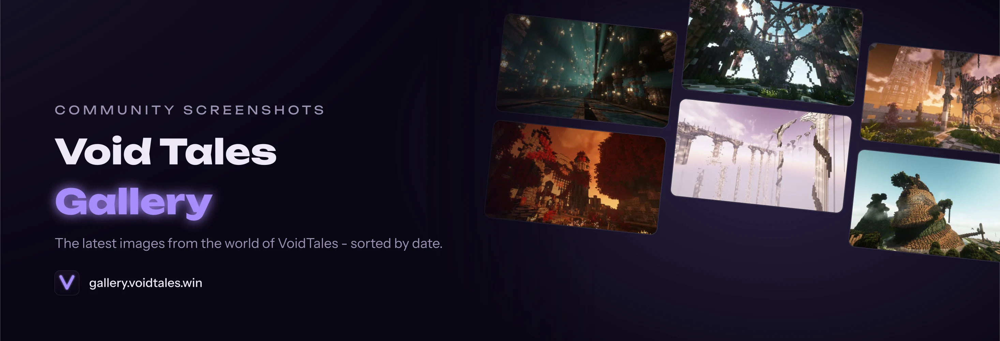

# 🎨 VoidTales Gallery




A sleek, high-performance photo gallery for the VoidTales Minecraft community - built with [Astro 7](https://astro.build/), Preact, and vanilla CSS. No backend, no database, no heavy frameworks. Live at [gallery.voidtales.win](https://gallery.voidtales.win).

> **Note for self-hosters:** This is a static site generator - there is no upload UI or admin panel. Images and metadata are plain files. See the [Self-Hosting Guide](./docs/self-hosting.md) for setup, the metadata format, and automation ideas.

## ✨ Features

- **Static & fast** - Astro-generated single page, lazy-loaded WebP thumbnails (Sharp, 3 sizes)
- **Live gallery without rebuilds** - the grid fetches `images.json` at runtime, so new images appear without regenerating the HTML
- **Masonry grid** with infinite scroll, animated batch transitions, and a sort selector (newest, oldest, name, random)
- **GLightbox lightbox** with share links (unique image IDs) and view-original buttons
- **Flicker-free dark mode** - CSS variables + localStorage, dark-first design
- **Staff badges** for configured community members
- **Config-driven** - texts, nav, hero, and sorting live in `src/config/`, not in components
- **Self-hosted fonts** via the Astro Fonts API - no external font requests
- **Optional external content downloads** at build time (fileserver/CI integration)

## 🚀 Quick Start

Requires Node ≥ 22.12 and pnpm.

```bash
pnpm install
pnpm run gen:testdata   # optional: 44 dummy images for local testing
pnpm run dev            # http://localhost:4321
```

To use your own images: originals go in `public/images/original/`, metadata as Markdown frontmatter in `src/content/photos/`, then `pnpm run gen:thumbs`. Full walkthrough in the [Self-Hosting Guide](./docs/self-hosting.md).

## 🔧 Commands

| Command | What it does |
|---|---|
| `pnpm run dev` | Dev server with image/metadata watching |
| `pnpm run build` | Thumbnails + `astro check` + production build |
| `pnpm run check` | `astro check` + Biome lint |
| `pnpm run stylelint` | Lint CSS/Astro styles |
| `pnpm run gen:thumbs` | Generate WebP thumbnails (200/400/800px) |
| `pnpm run gen:imagejson` | Regenerate `images.json` + sitemap |
| `pnpm run gen:testdata` / `cleanup:testdata` | Create/remove local test data |

## 📁 Project Structure

```
public/images/original/   Full-size images
public/images/thumbs/     Generated WebP thumbnails
src/content/photos/       Markdown metadata (one file per image)
src/pages/index.astro     The single page
src/components/           Header, PhotoGrid(Client), SortSelector, ThemeToggle, …
src/config/               site.js, navigation.js, externaldownload.cjs
src/styles/               variables, base, layout, components, hero, gallery, lightbox
scripts/                  Image pipeline (thumbs, images.json, downloads, test data)
```

## 🤝 Contributing

1. Fork, clone, `pnpm install`, `pnpm run dev`
2. Branch: `git checkout -b feature/your-feature`
3. Before committing: `pnpm run check` and `pnpm run stylelint`
4. Open a PR with a clear description ([Conventional Commits](https://www.conventionalcommits.org/) appreciated)

Questions? Join our [Discord](https://discord.gg/QEMQsFect6) or open an issue.

## 📜 License

[MIT](./LICENSE) - © 2025 inventory69 & Hyphonical
